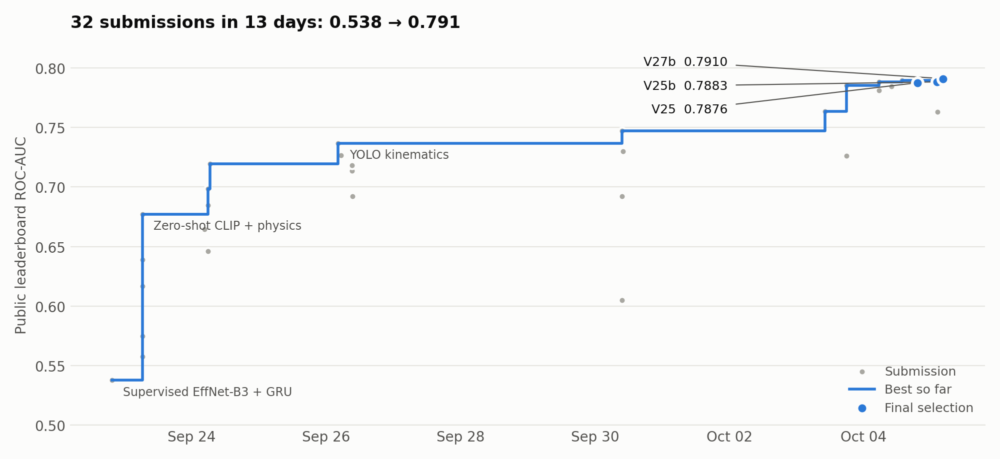
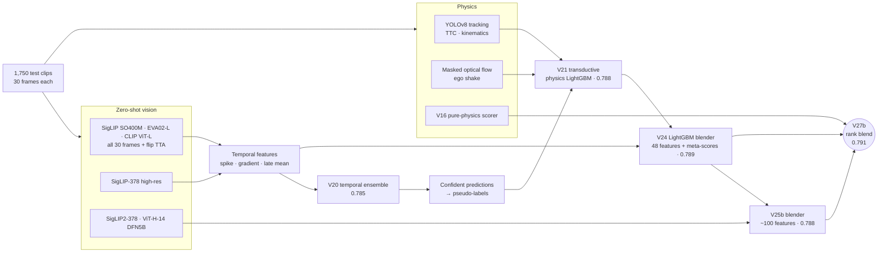

<div align="center">

# Dashcam Crash Detection

**Zero-shot vision-language features, multi-object-tracking physics and transductive pseudo-labelling, combined to detect car crashes in 30-frame dashcam clips.**

Kaggle · *Cooked or Not?* · binary video classification · ROC-AUC


</div>

<picture>
  <source media="(prefers-color-scheme: dark)" srcset="assets/leaderboard_dark.png">
  
</picture>

> **New here?** Start with the [walkthrough notebook](notebooks/walkthrough.ipynb). It tells the whole story in 8 short sections, with live plots and every number recomputed from the data.

## TL;DR

| | |
|---|---|
| **Task** | Given 30 frames (384×224) of dashcam video, output the probability that a crash happens. |
| **Data** | 3,000 labelled training clips, 1,750 test clips. |
| **Best public score** | **0.79098 AUC** (V27b) on the public leaderboard (5 Oct 2026). |
| **Key result** | A fully supervised video model scored **0.538**. Dropping supervised training in favour of zero-shot CLIP-family features, tracking physics and test-set pseudo-labels reached **0.791**. |
| **Verified** | `tools/verify_pipeline.py --full` rebuilds V24 → V25b → V27b from cached features; all three match the submitted CSVs exactly (max abs diff 0.0). |

## The problem: models that ace train and fail on test

The first submission, an EfficientNet-B3 + GRU trained with 5-fold `GroupKFold`, reached **0.995** cross-validation AUC and **0.538** on the public leaderboard.

The diagnosis, made on day one ([`experiments/solve_v2.py`](experiments/solve_v2.py)) and confirmed quantitatively later, is in how the training set was built. It contains **1,500 groups of exactly two clips cut from the same video, always one crash and one normal clip taken just before it.** A model can separate each pair using scene and timing cues instead of learning what a crash looks like. The test set's normal clips are ordinary driving from other videos, so those cues vanish:

- A logistic-regression probe on CLIP + motion features still reaches **0.991** grouped cross-validation AUC on train.
- Within visually matched pairs, model scores correlate **−0.58** on train (opposite labels) but **+0.38** on test look-alikes (mostly the same label).

Details are in [docs/FINDINGS.md](docs/FINDINGS.md).

So the solution treats the training labels with suspicion and leans on signals that cannot overfit them:

1. **Zero-shot semantics:** CLIP-family models compare every frame to crash and normal-driving text prompts.
2. **Temporal shape:** a crash looks like a *spike* in crash similarity late in the clip, not a high average.
3. **Physics:** YOLOv8 tracking measures bounding-box expansion (time-to-collision), aspect-ratio instability and ego-motion shake.
4. **Transductive learning:** the most confident test predictions become pseudo-labels for LightGBM blenders that learn on the *test* distribution.

## Pipeline



**Final blend (V27b):** `0.85 · rank(V24) + 0.08 · rank(V16 physics) + 0.07 · rank(V25b)`. V16 correlates only **0.21** with V24, so a small dose adds information rather than noise.

## Results

Public leaderboard AUC. The full history is in [`submissions/leaderboard.csv`](submissions/leaderboard.csv).

| Stage | What changed | Public AUC | Δ |
|---|---|---:|---:|
| V1 | Supervised EfficientNet-B3 + GRU, 5-fold | 0.53770 | |
| Zero-shot | CLIP prompt scoring + motion heuristics, no training | 0.67702 | +0.139 |
| V6 | Foundation-model ensemble | 0.71953 | +0.043 |
| V7 | + YOLO kinematics | 0.73669 | +0.017 |
| V15 | Weighted ensemble: V7 physics + X-CLIP video + distilled CNN + masked flow | 0.74714 | +0.010 |
| V18 | SigLIP + EVA02 + CLIP over **all 30 frames**, temporal-spike features | 0.76349 | +0.016 |
| V20 | Same features at **378 px** (SigLIP-378) | 0.78547 | +0.022 |
| V21 | Transductive physics LightGBM on test pseudo-labels | 0.78826 | +0.003 |
| V24 | LightGBM blender over 48 features + meta-scores | 0.78943 | +0.001 |
| **V27b** | **Rank blend: 85% V24 + 8% V16 physics + 7% V25b** | **0.79098** | **+0.002** |

**What didn't work** (all kept in [`experiments/`](experiments/) and [docs/FINDINGS.md](docs/FINDINGS.md)):

| Idea | Public AUC | Why it failed |
|---|---:|---|
| ResNet3D trained on a re-labelled ("cleaned") train set | 0.60494 | Same train→test transfer problem as V1 |
| Semantic velocity (rate of change of frame embeddings) | 0.72632 | Normal turns and bumps move embeddings as much as crashes do |
| k-NN manifold smoothing on CLIP embeddings | 0.76322 | Look-alike test clips don't share labels reliably enough |
| Qwen2.5-VL-7B zero-shot (P(Yes) from logits) | 0.648 *(train subset)* | Too weak to help; not submitted |

### Final selection

The public leaderboard scores ~30% of the test set (~525 clips), so top submissions within ~0.003 of each other are statistically tied. The three final picks are chosen for **low rank correlation**, not only for public score:

| Submission | Public AUC | Spearman ρ vs V27b |
|---|---:|---:|
| V27b physics injection | 0.79098 | 1.000 |
| V25b supervised blender | 0.78829 | 0.953 |
| V25 standalone (SigLIP2 + ViT-H + physics) | 0.78755 | 0.903 |

## Repository layout

```
├── notebooks/         walkthrough.ipynb: the guided tour (start here)
├── pipeline/          the 12 scripts that produce the final submission, in run order
├── experiments/       every other approach that reached the leaderboard (V2–V28)
├── baselines/         supervised EfficientNet-B3 + GRU / attention baseline (V1)
├── kaggle/            Qwen2.5-VL zero-shot notebook (dual-T4, data-parallel)
├── tools/             reproducibility check, train-label audit, duplicate finder, charts
├── submissions/       every submitted CSV + leaderboard.csv (inputs to the blenders)
├── docs/FINDINGS.md   analysis, negative results and lessons
├── assets/            README figures
└── config.py          single source of truth for data / cache / submission paths
```

## Reproducing

```bash
git clone https://github.com/AbhijeetPatil2005/dashcam-crash-detection-.git
cd dashcam-crash-detection-
pip install -r requirements.txt

# Competition data: data/crash_competition_data/{train,test,*.csv}
# or point anywhere:  export CRASH_DATA_DIR=/path/to/crash_competition_data
```

**Quick check, no GPU, about 1 second.** Rebuild the final blend from the committed component submissions and compare it to what was submitted:

```bash
python tools/verify_pipeline.py          # final blend from committed components
python tools/verify_pipeline.py --full   # + both LightGBM blenders, needs cached features
```

**Full pipeline.** Feature extraction needs a GPU; the zero-shot backbones take several hours in total. Run [`pipeline/`](pipeline/) in order (see [`pipeline/README.md`](pipeline/README.md)). Features are cached in `artifacts/`, and every stage resumes from its cache.

| Env var | Default | Holds |
|---|---|---|
| `CRASH_DATA_DIR` | `data/crash_competition_data` | competition data |
| `CRASH_CACHE_DIR` | `artifacts/` | extracted features and embeddings |
| `CRASH_SUBMISSIONS_DIR` | `submissions/` | submission CSVs read and written by blenders |

## Limitations

- **Transductive by design.** V21–V25b train on pseudo-labels derived from test predictions. That is allowed here, but it means the blenders' cross-validation scores are not estimates of generalisation, so only leaderboard scores are reported.
- **Blend weights were chosen with public-leaderboard feedback.** The 8% / 7% injections gained about +0.002, which is within leaderboard noise.
- **Competition-specific.** Prompt sets and blend weights are tuned for this dataset and are not a deployable crash detector.

## License

[MIT](LICENSE)
